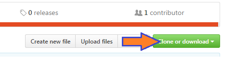
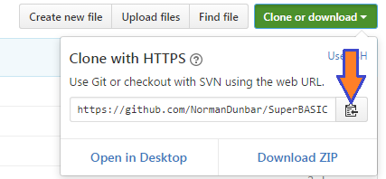

Obtaining the Source
====================

..  The following section is used as a target for a :ref: link in file p3_rst.rst. In order for this to work, we have to create a link just above the section header. It sadly will not work without one. :-(

.. _P2_FreeGitBook:

Free Git Book
-------------

You might like to download and read the *Pro Git* book, by Scott Chacon & Ben Straub. This is a book published by Apress but which is given away for free on the web at https://git-scm.com/book/en/v2 - various formats are available.

Introduction
------------

Before you can start making changes to the SuperBASIC manual, you must:

- ``Fork`` the repository on GitHub;
- ``Clone`` the fork down to your computer;
- Configure git;
- Make your changes or additions;
- Commit the changes to your local repository;
- ``Push`` the changes to your forked repository;
- Create a ``pull`` request to me;

At this point, after I've merged your changes, you can either:

- Delete your fork; or;
- Keep it, and keep it in sync with mine.

.. Note:: The following assumes that you are fully up to date with installing all the required software detailed in the previous part of the book.

Forking the Repository
----------------------

Forking the main repository is simple. 

- Go to the `repository on GitHub <https://github.com/NormanDunbar/SuperBASIC-Manual>`__\ .
- Click on the ``Fork`` button at the top of the screen, on the right:

  ..  image:: images/Fork.png
      :align: center
      :alt: Image showing how to fork a repository in GitHub.

- If you are a member of one or more organisations, as well as being an individual, you will be prompted to select a location. Choose whichever one applies.
- That's it. After a while, the repository will show up in your list of repositories.

You are now ready to ``pull`` the source code from your repository to your local computer, ready to edit.        

Pull the Source
---------------

In your favourite browser, alternatively you could use Internet Explorer, go to https://github.com/<your-name>/SuperBASIC-Manual (letter case *is* significant here by the way). This is your repository page.

On the right side, in a natty green colour, there's a button with the text "clone or download" written on it. 

Click it. A small dialogue will open up. The URL for your repository is preset in the text box, and the button on the right will copy the URL to the clipboard. Click it.

Change form the browser to your command line session. Make sure that you are in a location where you are happy to create a new folder to download the source files to. I use a top level ``SourceCode`` folder, so on my computer, this would be where I need to be::

    cd SourceCode
    
Now, type the following command::

    git clone <paste>
    
Where "<paste>" means that you should paste in the URL you copied from GitHub. The final command should look something like this::

    git clone https://github.com/<your-name>/SuperBASIC-Manual.git

Obviously, <your-name> would be as appropriate!    

After a few seconds or minutes - depending on your internet speed - you should find a new folder created, with the name ``SuperBASIC-Manual``.   

Configure Git
-------------

In your command line session, change into your new folder::

    cd SuperBASIC-Manual
    
The following configuration options are pretty much mandatory. They set the defaults for your username and email address for all your git work, now and in the future.

::

    git config --global user.name "Your Name"
    git config --global user.email YourName@YourDomain.co.uk

The ``--global`` flag means exactly that, they apply to all of git, not just this repository. You should also configure your default editor, for example, on Windows, to use Notepad++::

    git config --global core.editor "'C:/Program Files/Notepad++/notepad++.exe' -multiInst -nosession"
    
Alternatively, if you are on a 64 bit Windows system::

    git config --global core.editor "'C:/Program Files (x86)/Notepad++/notepad++.exe' -multiInst

On Linux, this works::

    git config --global core-editor xed

Line feeds are a nice little "gotcha" to watch out for. Windows editors *can* silently convert Linux/Mac/QL line feeds (LF) into Carriage Return plus Line Feed characters (CRLF). This is, to put it mildly, rather irritating!

If you are on Windows, set the following configuration option so that your editor doesn't mess things up for everyone else when you check in a file::

    git config --global core.autocrlf true

When you check out a file, git will convert the LF to CRLF automatically for you. If you are using notepad++ as your editor then the above is not really required as that editor can happily cope with LF as well as CRLF. Just be sure that you don't have it set up to save everything in CRLF mode. (Settings->Preferences->New Document)

Mac and Linux users should configure the following option instead::

    git config --global core.autocrlf input
    
This will ensure that if a Windows file with CRLF is checked out by you, it will be fixed when you check it back in. 

Hopefully now, everyone is happy.

Edit the Source
---------------

Very importantly, you should *never* work in the master branch. I've set up the repository with a *working* branch, and this is where the work should be done. When completely finished, the working branch can be merged back into the master branch.

..  Important::

    **We never, ever mess up the master branch!**

So, in a command line session, we do the following::

    cd SourceCode\SuperBASIC-Manual
    git branch

Git will respond with:: 
   
    * master

So we need to be well away from that particular branch::
    
    git checkout working
    git branch

And git should respond with::
    
      master
    * working

The working branch is where we need to be, always, so check often!
    
Editing the source is *mostly* done in plain text. The benefit of ReStructuredText is that it is *mostly* just typing and no special formatting is required. However, please see the section on ReStructuredText in Part 3, for details of the features we use for the manual.

The basic design of a keyword's entry in the manual is as follows, please try to stick with Rich's original format as much as possible, as the following template entry attempts to demonstrate::

    ..  _create-keyword:
    
    CREATE_Keyword
    ===============
    
    +----------+---------------------------------------------------------------------+
    | Syntax   | CREATE_keyword title$, #channel [ Some_text$] [ more_text$]         |
    +----------+---------------------------------------------------------------------+
    | Location | QL ROM, Toolkit II, etc                                             |
    +----------+---------------------------------------------------------------------+

    At this point here, there will be a number of paragraphs describing the command, 
    what it does, how it does it - if necessary - and so on. Very, very brief examples 
    of it's use may be found here.
    
    There may be minimal examples of the calling conventions, where these need special
    attention, delimiters or whatever, not covered in the ``Syntax`` table entries above.
    
    **Example**
    Please use the letter case demonstrated here for the section title - **Example**.
    
    The example section has a bold title, and gives a more complete example of the keyword's
    usage in context. 
    
    ::
    
        1000 REMark Demonstration of the (fictitious) CREATE_keyword command.
        1005 :
        1010 OPEN #3, "con_"
        1015 CREATE_keyword "OPEN", #3
        1020 CREATE_keyword "TITLE", #3, KeyWord$
        1025 CREATE_keyword "SYNTAX", #3, Syntax_1$, Syntax_2$
        1030 CREATE_keyword "LOCATION", #3, "QL ROM"
        1035 CREATE_keyword "DESCRIPTION", #3, Description$
        1040 CREATE_keyword "NOTE 1", #3, Note$(1)
        1045 CREATE_keyword "NOTE 2", #3, Note$(2)
        1050 CREATE_keyword "NOTE 3", #3, Note$(3)
        1055 CREATE_keyword "CROSS-REFERENCE", #3, Link$
        1060 CREATE_keyword "CLOSE", #3
        1065 CLOSE #3
        
    **Note 1**
    For notes, which are optional, please ensure that each note's section uses the letter case
    demonstrated here - **Note n** or **Notes** as appropriate.
    
    **Note 2**
    There may be notes sections if the keyword demands special attention. Notes will be numbered
    from 1 upwards for general purpose "applies to all" notes. Things to be aware of, how to
    crash the QL by misuse of the command etc.
        
    **Note 3**
    Where the normal QL differs from Minerva, or SMS etc, use a separate note for each.
    
    **CROSS-REFERENCE**
    Again, please use Rich's letter case for this section, which again has a bold heading. This
    section should describe, very briefly, other similar commands located elsewhere in this or
    other files.
    
    Please make sure that if this is a simple list of keyword links, see below, that they do not
    split across lines.
    
    This is a link :ref:`lower-case-keyword`
  
.. note::

   You should notice the first line in the above template. It is a link target. All keywords should have a link target set up just before the section header for that keyword. 

   Link targets are simply the keyword converted to lower case, with underscores replaces by a single hyphen, and spaces replaced with two hyphens. Percent and dollar characters are replaced by '-pct' and '-dlr' respectively. 
   
   The following examples should help make things clear:
   
   - **DIM** - ``..  _dim:`` - no special needs here!
   - **WHEN ERRor** - ``..  _when--error:`` - space replaced by '--', a double hyphen.
   - **PRINT_USING** - ``..  _print-using:`` - underscore replaced by '-', a single hyphen.
   - **DEV_NAME$** - ``..  _dev-name-dlr:`` - Underscore replaced. Dollar replaced by '-dlr'.
   - **CHAN_B%** - ``..  _chan-b-pct:`` - underscore replaces. Percent replaced by '-pct'.
   
.. warning::

   If you add a new keyword, and it has *exactly* the same name as another keyword in a different toolkit, then *do not* add a duplicate link target for the new keyword, leave the existing one alone and simply add your new keyword after the existing one with the same name, without adding a link target.

   Duplicate target names are not allowed and changing the existing one, perhaps to give a numeric suffix, will invalidate all links pointing at it. 

   It is perhaps better to have all links point at the first one and the viewer can scroll down to see the others. The source should resemble the following::

        .. _search:
        
        SEARCH
        ======
        
        This keyword was here first and has the original link target defined above. Yada yada yada.
        
        SEARCH
        ======
        
        Different toolkit, same keyword. There is no link target here. Yada yada yada.
        

Commit Your Changes Locally
---------------------------

Git is a *distributed* version control system. You has a local copy of your GitHub repository and you commit locally, and nothing ever leaves your computer, you don't even have to have an internet connection up and running. Eventually, though, you have to ``push`` your changes back to your fork of my repository.

You should commit frequently and often is the rule I've heard, but I'm a firm believer in only committing - as far as possible - when something is finished. You should however, be aware that the bigger the changes you make to a file, or files, means that there is a higher chance of a conflict when you come to commit, if someone else has amended the same region of the same file(s) as you have. This is a version control problem in general and is not specific to git.

Conflicts are not something you will come across when dealing with your own forked repositories - unless you conflict with yourself by changing the same part(s) of the same file(s) in two or more separate branches.

What Has Changed
~~~~~~~~~~~~~~~~

Before you ``commit`` your changes, it is good practice to be sure of what you have changed. The ``git status`` command will show you all the files that have changed since the most recent ``commit``::

    git status

..  note::
    
    In the following, you might notice that file names etc are somewhat different from the real SuperBASIC-Manual repository file names. Don't worry about this, it's because there are no current edits happening in that repository that can be used as an example.
    
Git responds with the following::

    On branch working
    Your branch is up-to-date with 'origin/working'.
    Changes not staged for commit:
      (use "git add <file>..." to update what will be committed)
      (use "git checkout -- <file>..." to discard changes in working directory)

            modified:   source/Part2.rst
            modified:   source/p2_download.rst

    Untracked files:
      (use "git add <file>..." to include in what will be committed)

            source/images/CloneButton.png
            source/images/GetURL.png

    no changes added to commit (use "git add" and/or "git commit -a")    

What does it all mean? Well, starting at the top, we have this::

    On branch working
    Your branch is up-to-date with 'origin/working'.

Which informs you of the branch you are working on, and if you are ahead of the GitHub repository as far as new commits are concerned, here I'm up to date and on the *working* branch. 

Next up, we see the list of files that have been modified since they were last committed::

    Changes not staged for commit:
      (use "git add <file>..." to update what will be committed)
      (use "git checkout -- <file>..." to discard changes in working directory)

            modified:   source/Part2.rst
            modified:   source/p2_download.rst

In this case, I've edited the two files listed above. Git gives a helpful hint as to what commands I should type in and execute in order to ``stage`` the files for a ``commit`` - ``git add``, or, how to revert the changes I made - get rid of them altogether and take me back to the most recent clean version of the file(s) - ``git checkout ...``.

Following on from the modified & tracked files, git shows a list of new (untracked) files within this local repository::

    Untracked files:
      (use "git add <file>..." to include in what will be committed)

            source/images/CloneButton.png
            source/images/GetURL.png

Untracked files are files that git is not tracking changes to, and which have not been added to the ``.gitignore`` file. These are, basically, brand new files. Some or all of these files may be added to the repository at a later date, but for now, git is aware that they exist, but doesn't really care!
            
And finally, a warning that if I ``commit`` now, nothing will happen::

    no changes added to commit (use "git add" and/or "git commit -a")    

    
Staging Changes
~~~~~~~~~~~~~~~
You can add files to be committed individually, or using wildcards::

    git add source/images/CloneButton.png
    git add source/images/getURL.png
    
Or::

    git add source/images/*.png
    
If the ``git status`` command's output is acceptable, and you simply want to add all modified files, and all unstaged files, then you can indeed stage *everything* as follows::

    git add --all
    
Git will not produce any messages unless something went wrong. If we check ``git status`` again, we see something different to the above::

    On branch working
    Your branch is up-to-date with 'origin/working'.
    Changes to be committed:
      (use "git reset HEAD <file>..." to unstage)

            modified:   source/Part2.rst
            new file:   source/images/CloneButton.png
            new file:   source/images/GetURL.png
            modified:   source/p2_download.rst

Git is telling us here that all the listed files are about to be committed. 
    
..  Note::

    If you amend a file that is already staged and thus appears in the list of files about to be committed, it will then also show up as a changed file, waiting to be staged. If you commit, the already staged (and unchanged) file will be committed leaving the amended file to be staged etc at a later date. 
    
    If you want the latest amendments included in your commit, you have to ``git add`` the file again. This will overwrite the previously staged file.
    
    
Commit
~~~~~~    

Committing your staged files means that they are added to your local repository, permanently. This doesn't mean you can't go back to a previous version of course, that is still possible.

When you commit, you must supply a message with brief (or otherwise) details of what you have done in this commit. If you don't supply one, your default editor will open and you should type your message there instead. It's easier just to supply brief details on the command line, with the ``-m`` option, as the following example shows::

    git commit -m "Details on getting the source files and editing them added."

Git will respond with something similar to the following::
    
    [working cc61ecf] Details on getting the source files and editing them added.
     4 files changed, 421 insertions(+), 143 deletions(-)
     create mode 100644 source/images/CloneButton.png
     create mode 100644 source/images/GetURL.png    
    
    
Push Changes Back to GitHub
---------------------------

When you ``commit`` your changes, they are only stored locally, on your computer, you now need to ``push`` those changes, and perhaps others, back to your GitHub repository. You can do this at any time when connected to the internet.

The following example shows the use of the ``git push`` command::

    git push

There's not much to it! Git will do some background processing and then something like the following output will appear on screen::

    Counting objects: 8, done.
    Delta compression using up to 8 threads.
    Compressing objects: 100% (8/8), done.
    Writing objects: 100% (8/8), 24.88 KiB | 0 bytes/s, done.
    Total 8 (delta 3), reused 0 (delta 0)
    remote: Resolving deltas: 100% (3/3), completed with 3 local objects.
    To https://github.com/SinclairQL/UpdatingSuperBASICManual.git
       dca541e..cc61ecf  working -> working

That's it. All your locally committed changes have now been pushed back online to your GitHub repository. However, although they are in your repository, they are not in mine, and it's mine that the online documentation at `ReadTheDocs.io <http://superbasic-manual.readthedocs.io/en/latest/>`__ is generated from, so, how do you go about getting your changes merged into my repository, and update the online manual? Read on.      

Create a Pull Request
---------------------

At this point I could write lots and lots of text about how you would go about creating a pull request. It's not difficult, and in fact, when you push a change to a forked repository and then visit (or refresh) the repository page in your browser, you will notice that GitHub has seen your commit, understood that you have a forked repository, and will put a big green button with "create a pull request" on it.

Click the button, add a descriptive heading, add a descriptive - ahem - description of what you did etc, and OK. Job done, I'll hear from GitHub that you have raised a ``pull`` request and I'll be able to inspect it, communicate with you, and - eventually - merge your changes into the main repository, which will cause a rebuild of the documentation over on http://superbasic-manual.readthedocs.io.

If you really need *more* details, then get yourself a copy of the (free) book "Pro Git" by Scott Chacon, from https://git-scm.com/book/en/v2, and check out chapter 6 which is all about GitHub. There is a whole section on creating and maintaining ``pull`` requests. It starts around page 203.

Delete Your Fork
----------------

Your work is complete. Well, it is when you hear back from me that your work has been ``pull``\ ed into the main repository, so at this point you have the option of deleting your forked repository as it is no longer needed. 

You don't have to delete it though, if you think that you might do some more work in the future, however, this means that from time to time, and *definitely* before you do any more work, you need to sync your fork of the main repository with any work being done and pulled into the main repository itself. This is explained below, in some detail.

Keeping Your Fork in Sync
-------------------------

If you think that you might do some more work on the manual at a later date, then why not keep a hold of your forked repository and update it as and when required to sync it with the main repository. It's not all that difficult at all.

Add an Upstream Remote
~~~~~~~~~~~~~~~~~~~~~~

The first and most important thing to do is add the main repository as a ``remote``. Don't worry about the term ``remote`` it's just a name as far as we need to be bothered!

Open up a command line session and execute the following commands::

    cd SuperBASIC-Manual
    git remote add upstream https://github.com/NormanDunbar/SuperBASIC-Manual.git
    
That's it! You can check that it worked as follows::

    git remote -v
    
The output should resemble the following::

    upstream https://github.com/NormanDunbar/SuperBASIC-Manual.git (fetch)
    upstream https://github.com/NormanDunbar/SuperBASIC-Manual.git (push)
    
From now on, the name *upstream* will refer to my repository, the one you originally forked back at the start of this section. *Upstream/master* and *upstream/working* refer to the appropriate branches on my repository.

Sync Your Fork
~~~~~~~~~~~~~~

Your fork may be behind the upstream repository, as the main repository is now referred to in your development system, so before making any changes, bring your fork up to date. You need to be sure that all your local changes are ``push``\ ed to your fork first though.

The following commands will commit and push your latest work back to your fork. This will not be necessary if you have not done any work since the last push.

::

    git status
    git add ....
    git commit -m "Pushing my latest work before syncing from upstream."
    git push

Now that your fork is up to date will your local work, you should fetch the upstream/master branch. Doing this will also cause your development area to effectively do a ``git checkout upstream/master`` command, so you will need to ``checkout`` your own *master* branch afterwards::

    git fetch upstream
    git checkout master
    git merge upstream/master
    git push

That's the *master* branch taken care of. We don't however, do our work in that branch, we use the *working* branch, so we also need to be sure that we have synced our *working* branch with upstream too::
    
    git fetch upstream/working
    git checkout working
    git merge upstream/working
    git push

Now we are up to date *locally* and our fork is at the same commit point as the upstream repository. We can now go to work. You will (probably):

- Make changes and test in the local *working* branch;
- ``Commit`` those changes and ``push`` them to your fork's *working* branch;
- ``Check out`` your *master* branch
- ``Merge`` the changes from your *working* branch;
- ``Push`` those to your fork's *master* branch;
- Raise a ``pull`` request in the normal manner.

All of these steps are described in some detail, above.
    
    
    